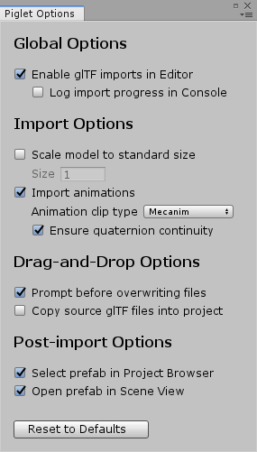

-   Online Manual:
    <https://awesomesaucelabs.github.io/piglet-manual/>
-   Asset Store Page: <https://assetstore.unity.com/packages/slug/173425>
-   Support Email: "awesomesaucelabs" (at gmail)

{width="40%"}

# Table of Contents

* [Introduction](#introduction)
* [Features](#features)
    * [Supported glTF Extensions](#supported-gltf-extensions)
* [Known Issues](#known-issues)
* [Installation](#installation)
* [Editor Imports](#editor-imports)
    * [Importing glTF Models into your Unity Project](#importing-gltf-models-into-your-unity-project)
    * [Editor Animation Tutorial](#editor-animation-tutorial)
        * [Previewing Animations in the Editor](#previewing-animations-in-the-editor)
        * [Playing (Mecanim) Animations at Runtime](#playing-mecanim-animations-at-runtime)
    * [Editor Import Options (Piglet Options Window)](#editor-import-options-piglet-options-window)
* [Runtime Imports](#runtime-imports)
    * [Runtime Import Tutorial](#runtime-import-tutorial)
    * [Runtime Animation Tutorial](#runtime-animation-tutorial)
    * [Runtime Import API](#runtime-import-api)
        * [Overview](#runtime-import-api-overview)
        * [Creating a GltfImportTask](#creating-a-gltfimporttask)
        * [Configuring Callbacks on a GltfImportTask](#configuring-callbacks-on-a-gltfimporttask)
        * [Executing a GltfImportTask](#executing-a-gltfimporttask)
        * [Runtime Import Options](#runtime-import-options)
* [Optimizing glTF Files](#optimizing-gltf-files)
    * [Supercompressed Textures (Unity 2019.3+)](#supercompressed-textures)
        * [Overview](#supercompressed-textures-overview)
        * [Installing KtxUnity](#installing-ktxunity)
        * [Supercompressing Your glTF Textures](#supercompressing-your-gltf-textures)
    * [Draco Mesh Compression (Unity 2019.3+)](#draco-mesh-compression)
        * [Overview](#draco-overview)
        * [Installing DracoUnity](#installing-dracounity)
        * [Draco-compressing Your glTF Meshes](#draco-compressing-your-gltf-meshes)
* [URP Support (Unity 2019.3+)](#urp-support)
* [Sample Application: PigletViewer](#piglet-viewer)
* [Changelog](#changelog)
* [Footnotes](#footnotes)

# Introduction

Piglet is a Unity asset that allows you to load 3D models from [glTF
](https://www.threekit.com/blog/gltf-everything-you-need-to-know)
files, both in the Editor and at runtime. This gives you the ability
to import 3D models while your game is running, and also gives you
access to a huge collection of free/paid glTF models from
[Sketchfab](https://sketchfab.com/).

Visit the [Web
Demo](https://awesomesaucelabs.github.io/piglet-webgl-demo/)[^web-demo]
to try Piglet before you buy it.

# Features

* import glTF models in the Editor or at runtime
* import glTF models from `.gltf`, `.glb`, or `.zip` files, using file
  paths or HTTP URLs
* import and play glTF animations (including skins and blendshapes)
* import glTF textures and materials, for use with your own models
* supports supercompressed textures via [KtxUnity](https://github.com/atteneder/KtxUnity) (Unity 2019.3+)
* supports Draco mesh compression via [DracoUnity](https://github.com/atteneder/DracoUnity) (Unity 2019.3+)
* tested with glTF models from [Sketchfab](https://sketchfab.com/)
  and [Blender](https://www.blender.org/)
* supported render pipelines: built-in (Unity 2018.4+), URP (Unity 2019.3+)
* supported platforms: Windows, Mac, Android, iOS, WebGL, UWP
* full source code provided

## Supported glTF Extensions

The glTF format supports "extensions", in order to provide
functionality that goes beyond the standard capabilities of glTF.  For
sample models that test/demonstrate specific glTF features and
extensions, see [glTF 2.0 Sample
Models](https://github.com/KhronosGroup/glTF-Sample-Models/tree/master/2.0).

The table below shows the most common glTF extensions, and indicates
which ones are currently supported by Piglet.  For a more
comprehensive list of glTF extensions, see the [glTF Extension
Registry](https://github.com/KhronosGroup/glTF/tree/main/extensions).

This table was last updated in June 2022, for Piglet version 1.3.7.

Extension                                                                                                                                                      Supported?   Notes
---------                                                                                                                                                      ----------   -----
[KHR_draco_mesh_compression](https://github.com/KhronosGroup/glTF/blob/main/extensions/2.0/Khronos/KHR_draco_mesh_compression/README.md)                       YES          Requires [DracoUnity](https://github.com/atteneder/DracoUnity) (see [Installing DracoUnity](#installing-dracounity)).
[KHR_lights_punctual](https://github.com/KhronosGroup/glTF/blob/main/extensions/2.0/Khronos/KHR_lights_punctual/README.md)                                     NO
[KHR_materials_clearcoat](https://github.com/KhronosGroup/glTF/blob/main/extensions/2.0/Khronos/KHR_materials_clearcoat/README.md)                             NO
[KHR_materials_ior](https://github.com/KhronosGroup/glTF/blob/main/extensions/2.0/Khronos/KHR_materials_ior/README.md)                                         NO
[KHR_materials_sheen](https://github.com/KhronosGroup/glTF/blob/main/extensions/2.0/Khronos/KHR_materials_sheen/README.md)                                     NO
[KHR_materials_specular](https://github.com/KhronosGroup/glTF/blob/main/extensions/2.0/Khronos/KHR_materials_specular/README.md)                               NO
[KHR_materials_transmission](https://github.com/KhronosGroup/glTF/blob/main/extensions/2.0/Khronos/KHR_materials_transmission/README.md)                       NO
[KHR_materials_unlit](https://github.com/KhronosGroup/glTF/blob/main/extensions/2.0/Khronos/KHR_materials_unlit/README.md)                                     YES
[KHR_materials_variants](https://github.com/KhronosGroup/glTF/blob/main/extensions/2.0/Khronos/KHR_materials_variants/README.md)                               NO
[KHR_materials_volume](https://github.com/KhronosGroup/glTF/blob/main/extensions/2.0/Khronos/KHR_materials_volume/README.md)                                   NO
[KHR_mesh_quantization](https://github.com/KhronosGroup/glTF/blob/main/extensions/2.0/Khronos/KHR_mesh_quantization/README.md)                                 NO
[KHR_texture_basisu](https://github.com/KhronosGroup/glTF/blob/main/extensions/2.0/Khronos/KHR_texture_basisu/README.md)                                       YES          Requires [KtxUnity](https://github.com/atteneder/KtxUnity) (see [Installing KtxUnity](#installing-ktxunity)).
[KHR_texture_transform](https://github.com/KhronosGroup/glTF/blob/main/extensions/2.0/Khronos/KHR_texture_transform/README.md)                                 YES*         *Only scale and offset transformations are supported (no rotations).
[KHR_xmp_json_ld](https://github.com/KhronosGroup/glTF/blob/main/extensions/2.0/Khronos/KHR_xmp_json_ld/README.md)                                             NO
[EXT_lights_image_based](https://github.com/KhronosGroup/glTF/blob/main/extensions/2.0/Vendor/EXT_lights_image_based/README.md)                                NO
[EXT_mesh_gpu_instancing](https://github.com/KhronosGroup/glTF/blob/main/extensions/2.0/Vendor/EXT_mesh_gpu_instancing/README.md)                              NO
[EXT_meshopt_compression](https://github.com/KhronosGroup/glTF/blob/main/extensions/2.0/Vendor/EXT_meshopt_compression/README.md)                              NO
[EXT_texture_webp](https://github.com/KhronosGroup/glTF/blob/main/extensions/2.0/Vendor/EXT_texture_webp/README.md)                                            NO
[KHR_materials_pbrSpecularGlossiness](https://github.com/KhronosGroup/glTF/blob/main/extensions/2.0/Archived/KHR_materials_pbrSpecularGlossiness/README.md)    YES

# Known Issues

-   **Runtime imports may stall the main Unity thread**. I have done
    my best to minimize interruptions to the main Unity thread during
    runtime glTF imports. However, one significant issue is that Unity
    uploads textures to the GPU **synchronously**, and this can cause
    FPS drops when importing high resolution textures at runtime. For
    now, the best way to work around this issue is to either: (1)
    convert your textures to KTX2/BasisU format (see [Supercompressed
    Textures (Unity 2019.3+)](#supercompressed-textures)), or (2)
    lower the resolution/quality of your textures.

-   **Many glTF extensions are not supported (yet!).** I am steadily
    chipping away at this. See [Supported glTF
    Extensions](#supported-gltf-extensions) for details about which
    extensions are currently supported.

-   **Piglet does not create humanoid avatar mappings (yet!)**.  For
    the time being, there is no easy way to retarget humanoid
    animations (e.g. [Mixamo](https://www.mixamo.com/)) onto glTF
    models. This is a highly requested feature and I do plan to
    implement it.
    
-   **Piglet cannot export glTF files (yet!)**. So far,
    Piglet does not have any glTF export capabilities, neither in the
    Editor nor at runtime. This is a highly requested feature and I do
    plan to implement it.

# Installation

To set up Piglet in your project, purchase and install Piglet from the
[Asset Store
page](https://assetstore.unity.com/packages/slug/173425). Piglet works
with Unity 2018.4 or later, and does not require installation of any
third-party assets/dependencies.

Piglet bundles the following libraries:

  Library                                                                                                 Author                                                                                                          License       Path
  -----------------------------------------------------------                                             ------------------------------------------------------------------------                                        ------------- ------------------------------------------
  [Newtonsoft.Json-for-Unity](https://github.com/AwesomesauceLabs/Newtonsoft.Json-for-Unity/tree/piglet)  [Newtonsoft](https://www.newtonsoft.com)/[jilleJr@github](https://github.com/jilleJr/Newtonsoft.Json-for-Unity) MIT License   `Assets/Piglet/Dependencies/Json.NET`[^json.net]
  [SharpZipLib](https://github.com/icsharpcode/SharpZipLib)                                               [icsharpcode@github](https://github.com/icsharpcode)                                                            MIT License   `Assets/Piglet/Dependencies/SharpZipLib`
  [UnityGLTF](https://github.com/sketchfab/UnityGLTF)                                                     [Khronos](https://www.khronos.org/)/[Sketchfab](https://sketchfab.com)                                          MIT License   `Assets/Piglet/Dependencies/UnityGLTF`[^unity-gltf]

# Editor Imports

## Importing glTF Models into your Unity Project

Once you have installed Piglet from the Unity Asset Store, you 
can import glTF models into your Unity project by either:

1. Dragging-and-dropping a `.gltf`/`.glb`/`.zip` file from
a file browser application (e.g. Windows File Explorer) into
the Unity Project Browser (@fig:editor-import), **OR**
2. Saving a `.gltf`/`.glb`/`.zip` file directly into your Assets
folder from an external program (e.g. Blender).

For a video demonstration of the drag-and-drop method, see the [Editor
Import Demo video](https://youtu.be/wf26w0gcVcA).

In general, saving glTF files directly into your Assets folder
is a more efficient workflow, especially if you are working on a model
in Blender and frequently re-exporting it to glTF. However, one important
caveat is that the updated glTF file will not be reimported until you
switch focus back to Unity (e.g. Alt-Tab). Unfortunately, Unity does
not respond to project file changes while it is in the background.

After an Editor glTF import completes, an output folder is created in
your project with the same name as the input `.gltf`/`.glb`/`.zip`
file, minus the file extension. This folder contains a Unity prefab
for the imported model, as well as Unity assets for the individual
textures, materials, meshes, and animation clips
(@fig:editor-import). To use the imported model in your game, you can
simply drag-and-drop the prefab into your Unity scene(s).

{#fig:editor-import width="100%"}

There may be circumstances where you want copy a `.gltf`/`.glb`/`.zip`
file into your project without automatically converting it to a Unity
prefab. You can bypass/disable Piglet's automatic glTF imports
by either:

-   Holding down the `Control` or `Command` key while dragging-and-dropping
    the `.gltf`/`.glb`/`.zip` into the Unity Project Browser, **OR**
-   Unchecking `Enable glTF imports in Editor` in the Piglet Options
    window, located under `Window => Piglet Options` in the Unity menu.

## Editor Animation Tutorial

Piglet can import and play animations from glTF files, both in the
Editor and at runtime.  This section demonstrates how to preview
animation clips created during Editor imports, and how to play them
back from runtime scripts. For a video version of this section, see
the [Editor Animation Tutorial video](https://youtu.be/MX2cIKCxm90).

### Previewing Animations in the Editor

If a glTF file contains animations, Piglet will create an
`Animations` subdirectory under the main import directory containing: (1) an `AnimatorController`
asset ("controller") for playing the animations at runtime, (2) a
"Static Pose" `AnimationClip` for resetting the model to its default
pose, and (3) an `AnimationClip` asset for each animation from the
glTF file (@fig:animation-preview). The "controller" asset is not needed for
previewing animations but is further explained in [Playing (Mecanim)
Animations at Runtime](#playing-mecanim-animations-at-runtime).

To preview an glTF animation in the Editor, first select the
AnimationClip asset in the Project Browser window (@fig:animation-preview). This
will cause a blank Animation Preview Area to appear in the Inspector
window with the message `No model is available for preview. Please
drag a model into this Preview Area`. Next, drag the prefab for the
imported glTF model (located one level up from the `Animations`
folder) onto the Animation Preview Area. You should then be able to
click the Play button to view the animation in the Editor.

![Previewing an animation clip in the Editor. (A) The user
selects an animation clip in the "Animations" subdirectory, causing
the Animation Preview Area to appear in the Inspector (bottom right).
(B) The user drags the prefab for the model from the main import
directory onto the Animation Preview Area, in order to associate the
model with the animation clip. Having established this link, the user
is able to preview the animation by clicking the Play button in the
Animation Preview Area. **Attribution**: These screenshots depict the
["Cartoon
Hartman"](https://sketchfab.com/3d-models/morpher-animated-face-military-cartoon-hartman-538a674c39e24c15965231ab2bdb656a)
model by Willy Decarpentrie,
[skudgee@sketchfab](https://sketchfab.com/skudgee), [CC Attribution
License](https://creativecommons.org/licenses/by/4.0/).](images/animation-preview-figure.png){#fig:animation-preview width="100%"}

### Playing (Mecanim) Animations at Runtime

This section demonstrates how play animation clip assets from runtime
scripts.  By default, Editor glTF imports create Mecanim animation
clips, and the instructions in this section are specific to
Mecanim[^mecanim-vs-legacy] [^mecanim-tutorial]. For details about
playing Legacy animation clips at runtime, see the [Runtime Animation
Tutorial](#runtime-animation-tutorial) section of this manual[^why-legacy].

When a glTF file contains one or more animations, Piglet will attach
two additional components to the root `GameObject` of the model: (1)
an `Animator` component for controlling playback of the animation
clips, and (2) an `AnimationList` component with an ordered list of
the animation clips (@fig:mecanim-animation-components). The
`AnimationList` component allows users to access the
animation clips by their original index in the glTF file. More importantly, it
provides access to the `.name` field of each animation clip, which
is needed for play that clip with the `Animator` component.


model by Willy Decarpentrie,
[skudgee@sketchfab](https://sketchfab.com/skudgee), [CC Attribution
License](https://creativecommons.org/licenses/by/4.0/).](images/mecanim-animation-components-figure.png){#fig:mecanim-animation-components width="100%"}

Every `Animator` component depends on a state machine called an
`AnimatorController`, that determines which animation clip to
play at any given time (@fig:animator-controller). In most cases, there is a
one-to-one correspondence between `AnimatorController` states and
animation clips. In order to start playing a particular clip at runtime, we
just need to activate the correct state in the `AnimatorController`
and start the `Animator` playing. Both of these tasks are accomplished
by calling the `Animator.Play` method.

![An example `AnimatorController` used for playing
Editor-imported animation clips at runtime. An `AnimatorController` is
a state machine used by the `Animator` component to determine which
animation clip to play at any given time.  Piglet creates a default
`AnimatorController` asset called "controller" in the `Animations`
subdirectory (C). This controller contains one state per animation
clip (D) and two special states that are present in every
`AnimatorController`: "Any State" (A) and "Entry" (B). For regular
controller states, the link between the state and its corresponding
animation clip is set by the `Motion` field (E).](images/animator-controller-figure.png){#fig:animator-controller width="100%"}

@lst:play-mecanim-clip shows an example script that plays a Mecanim
animation clip as soon as Unity enters Play Mode. We start the
animation by calling the `Animator.Play` method, passing in the
initial `AnimatorController` state and layer[^controller-layers] as
arguments. By convention, Piglet uses the `.name` field of an
`AnimationClip` for the corresponding state name in the
`AnimatorController`, and thus we can get the state name by accessing
the target clip by index in the `AnimationList` component. Note that
@lst:play-mecanim-clip accesses the clip at index 1 in the
`AnimationList`, rather than index 0, because index 0 is reserved for
the special "Static Pose" clip that resets the model to its default
pose[^static-pose]. As such, the animations imported from the
glTF file always start at index 1. For the layer argument to
`Animator.Play`, we simply pass in 0, because the controller
generated by Piglet only uses the default layer.

```{#lst:play-mecanim-clip .cs}
using UnityEngine;
using Piglet;

public class AnimationBehaviour : MonoBehaviour
{
    void Start()
    {
        var anim = GetComponent<Animator>();
        var animList = GetComponent<AnimationList>();

        // Note: Imported animation clips always start
        // at index 1, because index "0" is reserved for
        // the "Static Pose" clip.

        var stateName = animList.Clips[1].name;

        // Note: We use 0 for the layer index argument
        // because the AnimatorController generated by
        // Piglet only uses the default layer.

        anim.Play(stateName, 0);
    }
}
```
: A minimal script for playing an Editor-imported (Mecanim) animation
clip at runtime. When this script is attached to the root `GameObject`
of the model, it plays the first animation from the glTF file,
immediately after Unity enters Play Mode. Note that the imported
animations always begin at index 1 in the `AnimationList`, because
index 0 is reserved for the "Static Pose" clip.

## Editor Import Options (Piglet Options Window)

A number of options controlling Editor glTF imports can be set in the Piglet
Options window, located under `Window => Piglet Options` in the Unity
menu.



  Option                           Description
  -------------------------------- ----------------------------------------------------------------------------------------------------------------------------------------------------------------------------------------------------------------------------------------
  `Enable glTF imports in Editor`  Enable/disable automatic glTF imports when adding new .gltf/.glb/.zip files to the project
  `Log import progress in Console` Log progress messages to Unity Console window during glTF imports (useful for debugging)
  
  : Global Options

  Option                                 Description
  -------------------------------------- ----------------------------------------------------------------------------------------------------------------------------------------------------------------------------------------------------------------------------------------
  `Scale model to standard size`         Enable/disable automatic resizing of imported model
  `Size`                                 Target size of model, along its longest dimension
  `Import animations`                    Enable/disable import of glTF animations as Unity `AnimationClip` assets
  `Animation clip type`                  "Mecanim" or "Legacy"
  `Ensure quaternion continuity`         Enable/disable [AnimationClip.EnsureQuaternionContinuity()](https://docs.unity3d.com/ScriptReference/AnimationClip.EnsureQuaternionContinuity.html) after importing each animation clip
  
  : Import Options

  Option                                 Description
  -------------------------------------- ----------------------------------------------------------------------------------------------------------------------------------------------------------------------------------------------------------------------------------------
  `Prompt before overwriting files`      Show confirmation prompt if glTF import directory already exists
  `Copy source glTF files into project`  Copy dragged-and-dropped glTF file/folder into project before performing glTF import. By default, only the Piglet-generated import directory is added to the project.
  
  : Drag-and-Drop Options

  Option                                 Description
  -------------------------------------- ----------------------------------------------------------------------------------------------------------------------------------------------------------------------------------------------------------------------------------------
  `Select prefab in Project Browser`     After a glTF import has completed, select/highlight the generated prefab in the Project Browser window
  `Open prefab in Scene View`            After a glTF import has completed, open the generated prefab in the Scene View tab. (This is equivalent to double-clicking the prefab in the Project Browser.)

  : Post-import Options

# Runtime Imports

Piglet can import a glTF model at runtime from a file path, an HTTP URL,
or a `byte[]` array containing the raw byte content of a .gltf/.glb/.zip
file. Runtime imports are performed incrementally, with minimum possible
interruption to the main Unity thread.

## Runtime Import Tutorial

This section walks through example code for importing a glTF model at
runtime. For a video version of this section, see the [Runtime Import
Tutorial video](https://youtu.be/f66wmgSTPI0).  In addition, the
example code in this section is included with Piglet under
`Assets/Piglet/Examples/RuntimeImport`.

As our example glTF model, we will use the `.glb` file for Sir
Piggleston (the Piglet mascot), which may be downloaded from
<https://awesomesaucelabs.github.io/piglet-webgl-demo/StreamingAssets/piggleston.glb>.
The minimal code to import the model at runtime is as follows:

```{#lst:runtime-import .cs}
using Piglet;
using UnityEngine;

/// <summary>
/// This MonoBehaviour provides a minimal example for using
/// Piglet to import glTF models at runtime.
/// </summary>
public class RuntimeImportBehaviour : MonoBehaviour
{
    /// <summary>
    /// The currently running glTF import task.
    /// </summary>
    private GltfImportTask _task;

    /// <summary>
    /// Unity callback that is invoked before the first frame.
    /// Create the glTF import task.
    /// </summary>
    void Start()
    {
        // Note: To import a local .gltf/.glb/.zip file, you may
        // instead pass an absolute file path to GetImportTask
        // (e.g. "C:/Users/Joe/Desktop/piggleston.glb"), or a byte[]
        // array containing the raw byte content of the file.

        _task = RuntimeGltfImporter.GetImportTask(
                "https://awesomesaucelabs.github.io/piglet-webgl-demo/StreamingAssets/piggleston.glb");
    }

    /// <summary>
    /// Unity callback that is invoked after every frame.
    /// Here we call MoveNext() to advance execution
    /// of the glTF import task.
    /// </summary>
    void Update()
    {
        // advance execution of glTF import task
        _task.MoveNext();
    }
}
```
: Minimal code to import a glTF file at runtime.

As shown in @lst:runtime-import, a runtime glTF import happens in two parts. First,
we create an import task by calling `RuntimeGltfImporter.GetImportTask`,
passing in the URL of the glTF model as a parameter. To load a local
.gltf/.glb/.zip file, we may instead pass `GetImportTask` an absolute
file path (e.g. "C:/Users/Joe/Desktop/piggleston.glb") or a `byte[]`
array containing the raw byte content of the file. Second, we advance
the execution of the import task by repeatedly calling `MoveNext()` on
the task. A convenient place to call `MoveNext()` is in the `Update()`
method, which is called by Unity once per frame. Continuing to call
`MoveNext()` after the import has completed does no harm.

Attaching the script from @lst:runtime-import to any game object in your Unity
scene is sufficient to import a glTF model at runtime. However, in a
real game/application, you will probably want tighter integration
between your own code and the importer. For example, you may want to
show progress messages while the model is loading, or to attach custom
MonoBehaviours to the model once it has loaded. To achieve these types
of behaviours, `GltfImportTask` provides callback hooks for: progress
messages (`OnProgress`), user cancelation (`OnAborted`), import errors
(`OnException`), and successful completion (`OnCompleted`).

As a first example of callback usage, we'll extend the example script
from @lst:runtime-import to print progress messages during the glTF import. We can
achieve this by assigning a custom method to the `OnProgress` callback
for the import task, as shown in @lst:runtime-import-with-progress.

```{#lst:runtime-import-with-progress .cs}
using Piglet;
using UnityEngine;

/// <summary>
/// This MonoBehaviour provides a minimal example for using
/// Piglet to import glTF models at runtime.
/// </summary>
public class RuntimeImportBehaviour : MonoBehaviour
{
    /// <summary>
    /// The currently running glTF import task.
    /// </summary>
    private GltfImportTask _task;

    /// <summary>
    /// Unity callback that is invoked before the first frame.
    /// Create the glTF import task.
    /// </summary>
    void Start()
    {
        // Note: To import a local .gltf/.glb/.zip file, you may
        // instead pass an absolute file path to GetImportTask
        // (e.g. "C:/Users/Joe/Desktop/piggleston.glb"), or a byte[]
        // array containing the raw byte content of the file.

        _task = RuntimeGltfImporter.GetImportTask(
                "https://awesomesaucelabs.github.io/piglet-webgl-demo/StreamingAssets/piggleston.glb");
        _task.OnProgress = OnProgress;
    }

    /// <summary>
    /// Callback that is invoked by the glTF import task
    /// to report intermediate progress.
    /// </summary>
    /// <param name="step">
    /// The current step of the glTF import process.  Each step imports
    /// a different type of glTF entity (e.g. textures, materials).
    /// </param>
    /// <param name="completed">
    /// The number of glTF entities (e.g. textures, materials) that have been
    /// successfully imported for the current import step.
    /// </param>
    /// <param name="total">
    /// The total number of glTF entities (e.g. textures, materials) that will
    /// be imported for the current import step.
    /// </param>
    private void OnProgress(GltfImportStep step, int completed, int total)
    {
        Debug.LogFormat("{0}: {1}/{2}", step, completed, total);
    }

    /// <summary>
    /// Unity callback that is invoked after every frame.
    /// Here we call MoveNext() to advance execution
    /// of the glTF import task.
    /// </summary>
    void Update()
    {
        // advance execution of glTF import task
        _task.MoveNext();
    }
}
```
: An extension of the runtime import script from @lst:runtime-import that
prints progress messages to the Unity console. In comparison to @lst:runtime-import,
the new parts of the code are the `OnProgress` method and the assignment
of `OnProgress` to `_task.OnProgress` in `Start`.

Another important use of callbacks is to run custom code after a glTF
import has successfully completed. For example, you might want to
automatically resize the model, parent the model to another game object,
or attach a custom `MonoBehaviour` to the model. These types of tasks
can be accomplished using the `OnCompleted` callback. To demonstrate,
the example script in @lst:runtime-import-spin uses the `OnCompleted` callback to obtain
a reference to the imported model, then uses that reference to
continually spin the model about the y-axis as if it were on a record
turntable.

The example in @lst:runtime-import-spin marks the end of this
tutorial. Good luck and happy coding!

```{#lst:runtime-import-spin .cs}
using Piglet;
using UnityEngine;

/// <summary>
/// This MonoBehaviour provides a minimal example for using
/// Piglet to import glTF models at runtime.
/// </summary>
public class RuntimeImportBehaviour : MonoBehaviour
{
    /// <summary>
    /// The currently running glTF import task.
    /// </summary>
    private GltfImportTask _task;

    /// <summary>
    /// Root GameObject of the imported glTF model.
    /// </summary>
    private GameObject _model;

    /// <summary>
    /// Unity callback that is invoked before the first frame.
    /// Create the glTF import task.
    /// </summary>
    void Start()
    {
        // Note: To import a local .gltf/.glb/.zip file, you may
        // instead pass an absolute file path to GetImportTask
        // (e.g. "C:/Users/Joe/Desktop/piggleston.glb"), or a byte[]
        // array containing the raw byte content of the file.

        _task = RuntimeGltfImporter.GetImportTask(
            "https://awesomesaucelabs.github.io/piglet-webgl-demo/StreamingAssets/piggleston.glb");
        _task.OnCompleted = OnComplete;
    }

    /// <summary>
    /// Callback that is invoked by the glTF import task
    /// after it has successfully completed.
    /// </summary>
    /// <param name="importedModel">
    /// the root GameObject of the imported glTF model
    /// </param>
    private void OnComplete(GameObject importedModel)
    {
        _model = importedModel;
        Debug.Log("Success!");
    }

    /// <summary>
    /// Unity callback that is invoked after every frame.
    /// Here we call MoveNext() to advance execution
    /// of the glTF import task.
    /// </summary>
    void Update()
    {
        // advance execution of glTF import task
        _task.MoveNext();

        // spin model about y-axis
        if (_model != null)
            _model.transform.Rotate(0, 1, 0);
    }
}
```
: An extension of the runtime import script from @lst:runtime-import that
spins the imported model about the y-axis. In comparison to @lst:runtime-import,
the new parts of the code are the `OnComplete` method, the
assignment of `OnComplete` to `_task.OnCompleted` in `Start`,
and the call to `_model.transform.Rotate` in `Update`.

### Runtime Animation Tutorial

This section demonstrates how to import and play animations from a
glTF file at runtime. For a video version of this section, see the
[Runtime Animation Tutorial video](https://youtu.be/FBLCKLZljRE).

Runtime glTF imports always use the Legacy
animation system, because Mecanim cannot create animation clips at
runtime[^mecanim-limitation] (as of December 2020). In practice,
I have not found this to be an issue -- for simple playback of glTF
animations, the Legacy system works very well.

When Piglet imports a glTF model with one or more animations at
runtime, it attaches two additional components to the root
`GameObject` of the model: (1) an `Animation` component for
controlling playback of the animation clips, and (2) an
`AnimationList` component containing an ordered list of the animation
clips (@fig:legacy-animation-components).  The `AnimationList`
component allows users to access the imported animation clips by their
original index in the glTF file. More importantly, it provides access
to the `.name` field of each animation clip, which is needed for
playing the clip with the `Animation` component.


model by Willy Decarpentrie,
[skudgee@sketchfab](https://sketchfab.com/skudgee), [CC Attribution
License](https://creativecommons.org/licenses/by/4.0/).](images/legacy-animation-components-figure.png){#fig:legacy-animation-components width="100%"}

@lst:runtime-animation shows an example script that imports a glTF
model with an animation at runtime, and then immediately plays the
animation. The basic steps for importing an animated glTF model are
the same as for static models: (1) create a `GltfImportTask` in the
`Start` method, and (2) advance execution of the task by calling
`GltfImportTask.MoveNext` in `Update`.

To play the animation after the model has finished loading, we assign
the `OnComplete` method to `_task.OnCompleted` in `Start`. Piglet
passes the root `GameObject` of the imported model as an argument to
`OnComplete`, which we then use to obtain a reference to the
`Animation` component for playing the animation. Since an `Animation`
component can hold any number of animation clips, we need to provide a
string-based key to `Animation.Play` that identifies the clip to
play. By convention, Piglet uses the `.name` field of each animation
clip as its key, and so we can obtain the desired key by accessing the
animation clip (by index) from the `AnimationList` component. Note
that the animation clips imported from glTF file always begin at index
1 of the `AnimationList`, because index 0 is reserved for the "Static
Pose" clip.

```{#lst:runtime-animation .cs}
using Piglet;
using UnityEngine;

/// <summary>
/// This MonoBehaviour provides a minimal example for
/// importing and playing glTF animations at runtime.
/// </summary>
public class RuntimeAnimationBehaviour : MonoBehaviour
{
    /// <summary>
    /// The currently running glTF import task.
    /// </summary>
    private GltfImportTask _task;

    /// <summary>
    /// Unity callback that is invoked before the first frame.
    /// Create the glTF import task and set up callback for
    /// successful completion.
    /// </summary>
    void Start()
    {
        // Uniformly scale the model such that the longest
        // dimension of its world-space axis-aligned bounding
        // box becomes 4.0 units.
        var importOptions = new GltfImportOptions();
        importOptions.AutoScale = true;
        importOptions.AutoScaleSize = 4.0f;

        // Note: To import a local .gltf/.glb/.zip file, you may
        // instead pass an absolute file path to GetImportTask
        // (e.g. "C:/Users/Joe/Desktop/piggleston.glb"), or a byte[]
        // array containing the raw byte content of the file.
        _task = RuntimeGltfImporter.GetImportTask(
            "https://awesomesaucelabs.github.io/piglet-webgl-demo/StreamingAssets/cartoon_hartman.zip",
            importOptions);

        _task.OnCompleted = OnComplete;
    }

    /// <summary>
    /// Callback that is invoked by the glTF import task
    /// after it has successfully completed.
    /// </summary>
    /// <param name="importedModel">
    /// the root GameObject of the imported glTF model
    /// </param>
    private void OnComplete(GameObject importedModel)
    {
        var anim = importedModel.GetComponent<Animation>();
        var animList = importedModel.GetComponent<AnimationList>();

        // Note: Imported animation clips always start
        // at index 1, because index "0" is reserved for
        // the "Static Pose" clip.
        var clipKey = animList.Clips[1].name;
        anim.Play(clipKey);

        Debug.Log("Success!");
    }

    /// <summary>
    /// Unity callback that is invoked after every frame.
    /// Here we call MoveNext() to advance execution
    /// of the glTF import task.
    /// </summary>
    void Update()
    {
        // advance execution of glTF import task
        _task.MoveNext();
    }
}
```
: An example script that performs runtime import of
a glTF model with an animation, then immediately plays that
animation. **Attribution**: This script uses the ["Cartoon
Hartman"](https://sketchfab.com/3d-models/morpher-animated-face-military-cartoon-hartman-538a674c39e24c15965231ab2bdb656a)
model by Willy Decarpentrie,
[skudgee@sketchfab](https://sketchfab.com/skudgee), [CC Attribution
License](https://creativecommons.org/licenses/by/4.0/).

## Runtime Import API

### Overview {#runtime-import-api-overview}

In Piglet, a runtime glTF import is accomplished by the following steps:

1.  Create a `GltfImportTask` by calling
    `RuntimeGltfImporter.GetImportTask`, passing in the file path,
    URL, or raw byte content of the input `.gltf`/`.glb`/`.zip` file
    as a parameter.  See [Creating a
    GltfImportTask](#creating-a-gltfimporttask) for details.
2.  Configure callbacks on the `GltfImportTask` to execute custom code
    for success/failure/progress events (optional). See [Configuring
    Callbacks on a
    GltfImportTask](#configuring-callbacks-on-a-gltfimporttask) for
    details.
3.  Execute the `GltfImportTask` by calling `MoveNext()` until the
    import has completed. See [Executing a
    GltfImportTask](#executing-a-gltfimporttask) for details.

For concrete code examples demonstrating the above steps, see the
[Runtime Import Tutorial](#runtime-import-tutorial).

### Creating a GltfImportTask

`RuntimeGltfImporter` provides the following static methods for creating a
`GltfImportTask`:

  ----------------------------------------------------------------------------------------------------------
  Method                                Return Type        Description
  -----------------------------------   -----------------  -------------------------------------------------
  `GetImportTask(string uri,`           `GltfImportTask`   Create an import task that imports the glTF model
  `GltfImportOptions options=null)`                        from `uri`, where `uri` is an absolute file path,
                                                           HTTP(S) URL, or Android content URI that points
                                                           to a `.gltf`/`.glb`/`.zip` file.

  `GetImportTask(Uri uri,`              `GltfImportTask`   Create an import task that imports the glTF model
  `GltfImportOptions options=null)`                        from `uri`, where `uri` is an absolute file path,
                                                           HTTP(S) URL, or Android content URI that points
                                                           to a `.gltf`/`.glb`/`.zip` file.

  `GetImportTask(byte[] data,`          `GltfImportTask`   Create an import task that imports from the raw
  `GltfImportOptions options=null)`                        byte content of a `.gltf`/`.glb`/`.zip` file.
  ---------------------------------------------------------------------------------------------------------

  : RuntimeGltfImporter Methods

All versions of `GetImportTask` accept an instance of `GltfImportOptions`
as an optional second argument. See [Runtime Import Options](#runtime-import-options)
for a description of the available options.

### Configuring Callbacks on a GltfImportTask

You can assign callback methods to delegate members of a
`GltfImportTask`, in order to run custom code for
success/failure/progress events. For example, callbacks can be used to
position a successfully imported model within a scene or to attach a
custom `MonoBehaviour`.

  Callback        Description
  --------------- -------------------------------------------------------------------------
  `OnProgress`    Invoked at regular intervals to report progress of `GltfImportTask`
  `OnAborted`     Invoked when `Abort()` is called on `GltfImportTask`
  `OnException`   Invoked when `GltfImportTask` throws an exception (e.g. file not found)
  `OnCompleted`   Invoked when `GltfImportTask` completes successfully

  : GltfImportTask Delegate Members

### Executing a GltfImportTask

`GltfImportTask` provides the following methods for controlling its own
execution:

  Method         Description
  -------------- -----------------------------------------------------------------------------------------------------------------------------------------
  `MoveNext()`   Advance execution of the import task by a small increment. This method should be called repeatedly until the import task has completed.
  `Abort()`      Abort the import task. This method should typically be called in response to a user action, such as pressing a "Cancel" button.

  : GltfImportTask Methods

### Runtime Import Options

  Piglet supports a number of options for controlling runtime glTF
  imports. To configure these options, users may pass a
  `GltfImportOptions` object as an optional second argument to
  `RuntimeGltfImporter.GetImportTask`. (See [Creating a
  GltfImportTask](#creating-a-gltfimporttask).)

  For a concrete example of `GltfImportOptions` usage, see
  @lst:runtime-animation from the [Runtime Animation
  Tutorial](#runtime-animation-tutorial) section.

  Currently, `GltfImportOptions` provides the following options:

  Option                       Default Description
  -----------------------      ------- -------------------------------------------------------------------------
  `ShowModelAfterImport`       `true`  Automatically unhide the model after a successful glTF import, by calling `SetActive(true)` on the root GameObject. Users might want to keep the model hidden until they have completed their own post-processing on the model (e.g. adding colliders).
  `AutoScale`                  `false` Automatically resize the model after a successful glTF import
  `AutoScaleSize`              `1.0`   Target size of model along its longest dimension
  `ImportAnimations`           `true`  Import glTF animations as Legacy animation clips
  `EnsureQuaternionContinuity` `true`  Call [AnimationClip.EnsureQuaternionContinuity()](https://docs.unity3d.com/ScriptReference/AnimationClip.EnsureQuaternionContinuity.html) after importing each animation clip.
  `CreateMipmaps`              `false` Create mipmaps for PNG/JPG textures during runtime glTF imports. This option is false by default because it roughly doubles the texture import time and increases the probability of FPS drops. This option has no effect on the creation of mipmaps for KTX2/BasisU textures, since mipmaps are always created in that case without any additional overhead. Likewise, mipmaps are always created during Editor glTF imports for all texture formats (PNG, JPG, KTX2/BasisU).
  `ZipPassword`                `null`  The password used to unpack encrypted `.zip` files.

# Optimizing glTF Files

## Supercompressed Textures (Unity 2019.3+) {#supercompressed-textures}

### Overview {#supercompressed-textures-overview}

Piglet can load glTF files that contain *supercompressed textures*[^supercompressed-textures] in KTX2/ETC1S or KTX2/UASTC format[^etc1s-vs-uastc] (i.e. [Basis Universal texture formats](https://github.com/BinomialLLC/basis_universal) in a [KTX 2.0 container](http://github.khronos.org/KTX-Specification/)). The main advantages of supercompressed textures are that: (1) textures load faster, and (2) glTF files are smaller. The main disadvantage is loss of image quality, which can give textures a "blocky" appearance. Depending on your application, the loss of image quality may not be noticeable, whereas the performance benefits are usually significant.

For a practical demonstration of the trade-offs, compare the ordinary and KTX2/ETC1S versions of the sample models at the [Piglet Web Demo](https://awesomesaucelabs.github.io/piglet-webgl-demo/). Note the differences in appearance, loading times, and file sizes. 

Before Piglet can load glTF files with supercompressed textures, you will need to install a third-party package called [KtxUnity](https://github.com/atteneder/KtxUnity) into your Unity project (see [Installing KtxUnity](#installing-ktxunity)). If you attempt to load a glTF file that contains supercompressed textures without installing KtxUnity, the textures will simply load as solid white, and Piglet will issue warnings on the Unity Console about failing to load the textures.

Finally, if you plan to use supercompressed textures with your models,
you will probably need to preprocess the glTF files yourself. At the
time of writing (Feb 2021), most glTF files on the web use PNG or JPEG
textures, including the glTF files downloaded from
[Sketchfab](https://sketchfab.com). I recommend using the
[gltf-transform](https://gltf-transform.donmccurdy.com/cli.html)
command line tool to compress the textures in your glTF files, as
described in [Supercompressing Your glTF
Textures](#supercompressing-your-gltf-textures).

### Installing KtxUnity

To load glTF files with supercompressed textures, you will need to
install [KtxUnity](https://github.com/atteneder/KtxUnity) via the
Unity Package Manager. Please use the following table to determine the
KtxUnity versions that are compatible/recommended for your version of
Unity, before proceeding with the installation instructions
below. (Note: This table was last updated in November 2021.)

Unity Version          Compatible KtxUnity Versions  Recommended KtxUnity Version
-------------          ----------------------------  ----------------------------
2019.2 or older        *not supported*               *not supported*
2019.3 through 2021.1  0.9.1 through 1.1.2           1.1.2
2021.2 or newer        2.0.0 or newer                2.1.2

Since KtxUnity is hosted by a third-party package registry
([OpenUPM](https://openupm.com/)), you will need to tell Unity where
to download the package by adding a [scoped
registry](https://docs.unity3d.com/Manual/upm-scoped.html) to the
`Packages/manifest.json` file under your Unity project directory. You
can do that by making the edits shown in @lst:manifest-json-ktxunity
and then restarting Unity. In addition, remember to change the KtxUnity
version in @lst:manifest-json-ktxunity to your required KtxUnity
version. If you want to perform the same edits in an automated
fashion, you can instead install the [OpenUPM CLI
tool](https://github.com/openupm/openupm-cli) and run `openupm add
com.atteneder.ktx@1.1.2` (or similar).

_Note!:_ I don't recommend using the "Installer Package" link from the
[KtxUnity
README.md](https://github.com/atteneder/KtxUnity#installing), since it
is just a more convoluted and fragile method for performing the text
edits shown in @lst:manifest-json-ktxunity. While the installer link
is more automatic, it prevents the user from understanding what is
really going on under the hood. Another advantage of manually editing
`manifest.json` is that you can pin KtxUnity to a specific version (if
desired).

In addition, please note the following "gotcha" when installing KtxUnity:

* When building for the PC/Standalone platform, remember to change `Architecture` from `x86` to `x86_64`. Otherwise, the native DLL for KtxUnity (`ktx_unity.dll`) will not be included in the build, and you may get a `DllNotFoundException` when you run your application.

```{#lst:manifest-json-ktxunity .json}
{
  "dependencies" : {
    "com.unity.collab-proxy" : "1.2.16",
    "com.unity.ide.rider" : "1.1.4",
    "com.unity.ide.vscode" : "1.2.0",
    "com.unity.test-framework" : "1.1.13",
    "com.unity.textmeshpro" : "2.0.1",
    "com.unity.timeline" : "1.2.14",
    "com.unity.ugui" : "1.0.0",
    "com.unity.modules.ai" : "1.0.0",
    "com.unity.modules.androidjni" : "1.0.0",
    "com.unity.modules.animation" : "1.0.0",
    "com.unity.modules.assetbundle" : "1.0.0",
    "com.unity.modules.audio" : "1.0.0",
    "com.unity.modules.cloth" : "1.0.0",
    "com.unity.modules.director" : "1.0.0",
    "com.unity.modules.imageconversion" : "1.0.0",
    "com.unity.modules.imgui" : "1.0.0",
    "com.unity.modules.jsonserialize" : "1.0.0",
    "com.unity.modules.particlesystem" : "1.0.0",
    "com.unity.modules.physics" : "1.0.0",
    "com.unity.modules.physics2d" : "1.0.0",
    "com.unity.modules.screencapture" : "1.0.0",
    "com.unity.modules.terrain" : "1.0.0",
    "com.unity.modules.terrainphysics" : "1.0.0",
    "com.unity.modules.tilemap" : "1.0.0",
    "com.unity.modules.ui" : "1.0.0",
    "com.unity.modules.uielements" : "1.0.0",
    "com.unity.modules.umbra" : "1.0.0",
    "com.unity.modules.unityanalytics" : "1.0.0",
    "com.unity.modules.unitywebrequest" : "1.0.0",
    "com.unity.modules.unitywebrequestassetbundle" : "1.0.0",
    "com.unity.modules.unitywebrequestaudio" : "1.0.0",
    "com.unity.modules.unitywebrequesttexture" : "1.0.0",
    "com.unity.modules.unitywebrequestwww" : "1.0.0",
    "com.unity.modules.vehicles" : "1.0.0",
    "com.unity.modules.video" : "1.0.0",
    "com.unity.modules.vr" : "1.0.0",
    "com.unity.modules.wind" : "1.0.0",
    "com.unity.modules.xr" : "1.0.0",
    "com.atteneder.ktx" : "1.1.2"
  },
  "scopedRegistries" : [
    {
      "name" : "OpenUPM",
      "url" : "https://package.openupm.com",
      "scopes" : [
        "com.atteneder"
      ]
    }
  ]
}
```
: Example edits to `Packages/manifest.json` in order to install
KtxUnity. After adding the highlighted text, restart Unity to
install the package.

### Supercompressing Your glTF Textures

Most glTF files store their textures in PNG or JPEG format. To convert the textures in your glTF files to KTX2/ETC1S or KTX2/UASTC, I recommend using the [gltf-transform](https://gltf-transform.donmccurdy.com/cli.html) command line tool.

In order to supercompress your textures with `gltf-transform`, you will first need to install:

* [NodeJS and NPM](https://www.npmjs.com/get-npm)
* [KTX-Software](https://github.com/KhronosGroup/KTX-Software). This project provides the `toktx` program that is invoked by `gltf-transform`. To install the software, go to the [GitHub releases page](https://github.com/KhronosGroup/KTX-Software/releases), click/expand "Assets" at the bottom of the release notes, and choose the appropriate package/installer for your O/S. Note that if you are using Windows, you will also need to add `C:\Program Files\KTX-Software\bin` to your `Path`, so that `gltf-transform` can find the `toktx` binary. 

Once you have installed the above prerequisites, you will be able to install `gltf-transform` by running:

```sh
npm install --global @gltf-transform/cli
```

You will then be able to convert the textures in a glTF file to KTX2/ETC1S by running:

```sh
gltf-transform etc1s input.glb output.glb
```

or to KTX2/UASTC by running:

```sh
gltf-transform uastc input.glb output.glb
```

The `gltf-transform` program provides options for restricting the conversion to specific textures ("slots"), adjusting quality settings, and more. See `gltf-transform etc1s --help` or `gltf-transform uastc --help` for further details.

## Draco Mesh Compression (Unity 2019.3+) {#draco-mesh-compression}

### Overview {#draco-overview}

Piglet can load glTF files that use _Draco mesh
compression_[^draco-mesh-compression]. The main benefit of using Draco
compression is that it can substantially reduce the size of your glTF
files (e.g. 20% of original size), especially if your model contains
large/complex meshes.  While using Draco compression does introduce
some computational overhead, the impact on model loading times is
usually neglible.

For a practical demonstration of the benefits, compare the ordinary
and Draco-compressed versions of the models at the [Piglet Web
Demo](https://awesomesaucelabs.github.io/piglet-webgl-demo/). Note the
large differences in file sizes and the small differences in loading
times. For further examples of real-world Draco compression results,
see [Draco Compressed Meshes with glTF and 3D
Tiles](https://cesium.com/blog/2018/04/09/draco-compression/).

Before Piglet can load Draco-compressed glTF files, you will need to
install a third-party package called
[DracoUnity](https://github.com/atteneder/DracoUnity) into your Unity
project (see [Installing DracoUnity](#installing-dracounity)). If
you attempt to load a Draco-compressed glTF file without installing
DracoUnity, the glTF import will fail with an error in the Unity console.

Finally, if you plan to use Draco-compressed meshes for your models,
you will probably need to preprocess the glTF files yourself.  At the
time of writing (May 2021), most glTF files available on the web use
uncompressed meshes, including the glTF files downloaded from
[Sketchfab](https://sketchfab.com). I recommend using the
[gltf-transform](https://gltf-transform.donmccurdy.com/cli.html)
command line tool to compress the meshes in your glTF files, as
detailed in [Draco-compressing Your glTF
Meshes](#draco-compressing-your-gltf-meshes).

### Installing DracoUnity

To load glTF files that use Draco mesh compression, you will need to
install
[DracoUnity](https://github.com/atteneder/DracoUnity)
via the Unity Package Manager. Please use the following table to
determine the DracoUnity versions that are compatible/recommended for
your version of Unity, before proceeding with the installation
instructions below. (Note: This table was last updated in November
2021.)

Unity Version          Compatible DracoUnity Versions  Recommended DracoUnity Version
-------------          ------------------------------  ------------------------------
2019.2 or older        *not supported*                 *not supported*
2019.3 through 2021.1  1.1.0 through 3.3.2             3.3.2
2021.2 or newer        4.0.0 or newer                  4.0.2

Since DracoUnity is hosted by a third-party package registry
([OpenUPM](https://openupm.com/)), you will need to tell Unity where
to download the package by adding a [scoped
registry](https://docs.unity3d.com/Manual/upm-scoped.html) to the
`Packages/manifest.json` under your Unity project directory. You can
do that by making the edits shown in @lst:manifest-json-dracounity and
then restarting Unity. In addition, remember to change the DracoUnity
version in @lst:manifest-json-dracounity to your required DracoUnity
version. If you want to perform the same edits in an
automated fashion, you can instead install the [OpenUPM CLI
tool](https://github.com/openupm/openupm-cli) and run `openupm add
com.atteneder.draco@3.3.2` (or similar).

_Note!:_ I don't recommend using the "Installer Package" link from the
[DracoUnity
README.md](https://github.com/atteneder/DracoUnity#installing), since
that is just a more convoluted and fragile method for performing the
text edits shown in @lst:manifest-json-dracounity. While the installer
link is more automatic, it prevents the user from understanding what
is really going on under the hood. Another advantage of manually
editing `manifest.json` is that you can pin DracoUnity to a
specific version (if desired).

In addition, please note the following "gotcha" when installing DracoUnity:

* When building for the PC/Standalone platform, remember to change `Architecture` from `x86` to `x86_64`. Otherwise, the native DLL for DracoUnity (`draco_unity.dll`) will not be included in the build, and you may get a `DllNotFoundException` when you run your application.

```{#lst:manifest-json-dracounity .json}
{
  "dependencies" : {
    "com.unity.collab-proxy" : "1.2.16",
    "com.unity.ide.rider" : "1.1.4",
    "com.unity.ide.vscode" : "1.2.0",
    "com.unity.test-framework" : "1.1.13",
    "com.unity.textmeshpro" : "2.0.1",
    "com.unity.timeline" : "1.2.14",
    "com.unity.ugui" : "1.0.0",
    "com.unity.modules.ai" : "1.0.0",
    "com.unity.modules.androidjni" : "1.0.0",
    "com.unity.modules.animation" : "1.0.0",
    "com.unity.modules.assetbundle" : "1.0.0",
    "com.unity.modules.audio" : "1.0.0",
    "com.unity.modules.cloth" : "1.0.0",
    "com.unity.modules.director" : "1.0.0",
    "com.unity.modules.imageconversion" : "1.0.0",
    "com.unity.modules.imgui" : "1.0.0",
    "com.unity.modules.jsonserialize" : "1.0.0",
    "com.unity.modules.particlesystem" : "1.0.0",
    "com.unity.modules.physics" : "1.0.0",
    "com.unity.modules.physics2d" : "1.0.0",
    "com.unity.modules.screencapture" : "1.0.0",
    "com.unity.modules.terrain" : "1.0.0",
    "com.unity.modules.terrainphysics" : "1.0.0",
    "com.unity.modules.tilemap" : "1.0.0",
    "com.unity.modules.ui" : "1.0.0",
    "com.unity.modules.uielements" : "1.0.0",
    "com.unity.modules.umbra" : "1.0.0",
    "com.unity.modules.unityanalytics" : "1.0.0",
    "com.unity.modules.unitywebrequest" : "1.0.0",
    "com.unity.modules.unitywebrequestassetbundle" : "1.0.0",
    "com.unity.modules.unitywebrequestaudio" : "1.0.0",
    "com.unity.modules.unitywebrequesttexture" : "1.0.0",
    "com.unity.modules.unitywebrequestwww" : "1.0.0",
    "com.unity.modules.vehicles" : "1.0.0",
    "com.unity.modules.video" : "1.0.0",
    "com.unity.modules.vr" : "1.0.0",
    "com.unity.modules.wind" : "1.0.0",
    "com.unity.modules.xr" : "1.0.0",
    "com.atteneder.draco" : "3.3.2"
  },
  "scopedRegistries" : [
    {
      "name" : "OpenUPM",
      "url" : "https://package.openupm.com",
      "scopes" : [
        "com.atteneder"
      ]
    }
  ]
}
```
: Example edits to `Packages/manifest.json` in order to install
DracoUnity. After adding the highlighted text, restart Unity to
install the package.

### Draco-compressing Your glTF Meshes

Most glTF files store their meshes in standard uncompressed form. To Draco-compress
the meshes in your glTF files, I recommend using the  [gltf-transform](https://gltf-transform.donmccurdy.com/cli.html) command line tool.

In order to install `gltf-transform`, you will first need to install [NodeJS and NPM](https://www.npmjs.com/get-npm). Then you will be able to install `gltf-transform` by running:

```sh
npm install --global @gltf-transform/cli
```

Once `gltf-transform` is installed, you will be able to Draco-compress your glTF
files by running:

```sh
gltf-transform draco input.glb output.glb
```

The `gltf-transform draco` command provides various options for controlling
compression and quantization. See `gltf-transform draco --help` for further
details.

# URP Support (Unity 2019.3+) {#urp-support}

Piglet supports the Universal Render Pipeline (URP) in Unity 2019.3 or
newer. To use Piglet with a URP-based project, unpack the shaders from
the appropriate `.unitypackage` file in `Assets/Piglet/Extras`. For
Unity versions 2019.3.0f6 through 2020.1.x, use
`URP-Shaders-2019.3.unitypackage`. For Unity 2020.2.0b14 or newer, use
`URP-Shaders-2020.2.unitypackage`.

The shader files will be unpacked into
`Assets/Piglet/Resources/Shaders/URP`. If you to forget unpack the
shaders before performing an Editor or runtime glTF import, Piglet
will fail with an error reminding you to install the shaders.

# Sample Application: PigletViewer {#piglet-viewer}

{#fig:webgl-demo width="800"}

PigletViewer is a sample application which uses Piglet to view 3D
models from glTF files (\`.gltf\`, \`.glb\`, or \`.zip\`), and which
is used for the [Piglet Web
Demo](https://awesomesaucelabs.github.io/piglet-webgl-demo/). For the
benefit of Piglet customers, I have published the source code and
documentation for PigletViewer online at
<https://github.com/AwesomesauceLabs/piglet-viewer>, under an MIT
license. PigletViewer currently supports builds for Windows, Mac,
Android, iOS, and WebGL, and thus it may be a useful reference for
Piglet users developing for those platforms. In general, I recommend
looking at the [Runtime Import Tutorial](#runtime-import-tutorial)
before exploring the PigletViewer code, as the tutorial provides a
much more succinct introduction to the Piglet API.

# Changelog

## Release 1.3.7 (2022-06-21)

Added:

* UWP is now officially supported (e.g. HoloLens).
* Added support for `KHR_texture_transform`.
* Added support for `KHR_materials_unlit`.
* Added `CreateMipmaps` option to create mipmaps for PNG/JPG textures during runtime glTF imports. This option is disabled by default because the wallclock time for importing textures is roughly doubled. The `CreateMipmaps` option has no effect  on Editor glTF imports because mipmaps are always created in that case.
* Added `EnsureQuaternionContinuity` option for both Editor and runtime glTF imports. This option is enabled by default, but disabling it sometimes solves minor animation glitches.
* Added `ZipPassword` for decrypting password-protected zip files (runtime glTF imports only).

Fixed:

* Fixed incorrect values for color factors (e.g. `baseColorFactor`, `emissiveFactor`). Unity expects `Color` shader properties to be provided in Gamma space, whereas I was directly passing through the linear color values from the glTF file. As a result, the colors for untextured glTF models were too dark/saturated. Most textured glTF models will be unaffected by this change, since they typically use the default white/black values for the color factors.
* Fixed incorrect rendering of `VoxEdit`-generated glTF files as solid black. This problem was caused by my use of negative UV coords, in order to fix the orientation of upside-down PNG/JPG textures. (For some reason, Unity's texture loading APIs load PNG/JPG images into textures upside-down.) I have now updated the code to use equivalent UV coords in the [0,1] range, so that textures render correctly with both `Repeat` and `Clamp` modes.
* Got rid of the annoying (but harmless) warning: `The Animator Controller (controller) you have used is not valid. Animations will not play`, when importing animations in the Editor.
* Piglet imports now fail with an error message if the glTF file requires a glTF extension (e.g. `KHR_mesh_quantization`) that is not implemented by Piglet. Previously, Piglet would continue importing the file anyway, and then crash or produce incorrect results. Failing with an error message is better because it lets the user know the exact cause of the problem.
* For projects that use the built-in render pipeline, materials will now render as single-sided or double-sided as per the `doubleSided` flag of the glTF material. Unfortunately, the URP shaders are still hardcoded to use double-sided rendering, since Unity's shader graphs do not provide any way to control single-sided/double-sided rendering via script.
* Fixed rare animation import bug that would cause different channels within the same animation clip to become misaligned. This bug was caused by independently trimming "dead time" from the start of each animation channel. I now make sure to trim all channels in an animation clip by the same amount.
* Fixed rare crash while loading morph targets, when `mesh.weights` is not explicitly set by the glTF file. According to the glTF spec, `mesh.weights` should be treated as an array of zeroes when not explicitly set, and I have changed the Piglet code to behave accordingly. 

## Release 1.3.6 (2022-02-16)

Fixed:

* A permanent fix for conflicts between Piglet's `Newtonsoft.Json.dll` and Unity's "Newtonsoft Json" package (hurray!). To address this issue, I forked the `Newtonsoft.Json-for-Unity` project, moved all of the C# classes from namespace `Newtonsoft.Json` -> `Piglet.Newtonsoft.Json`, and renamed the output DLL file from `Newtonsoft.Json.dll` -> `Piglet.Newtonsoft.Json.dll`. You can see the exact changes I made at: https://github.com/AwesomesauceLabs/Newtonsoft.Json-for-Unity/commits/piglet
* IL2CPP builds work out-of-the-box now, for all supported platforms and Unity versions. Previously, IL2CPP builds in Unity versions older than Unity 2020.3.10f1 would throw exceptions on startup, due to Json.NET's use of C# reflection. Switching from the stock Json.NET DLL to a custom build of the Newtonsoft.Json-for-Unity "AOT" DLL (as described above) fixed this issue. For further info about using Json.NET with IL2CPP, see the `Newtonsoft.Json-for-Unity` wiki: https://github.com/jilleJr/Newtonsoft.Json-for-Unity/wiki/What-even-is-AOT
* Fixed animation of multi-material meshes. Previously, only one part of the mesh corresponding to the first material would be animated, while the other parts would remain stationary.
* Fixed morph targets on multi-material meshes. Previously, morph targets on multi-material meshes would cause an IndexOutOfRangeException.
* Fixed "missing URP shader" error when loading models that use the default material. (This bug was introduced in Piglet 1.3.5.)
* Fixed missing (pink) material when importing models in the Editor that use the default material. (This bug was probably introduced in Piglet 1.3.3.)

## Release 1.3.5 (2022-01-06)

Fixed:

* Piglet now imports models correctly in linear rendering mode, in all possible scenarios: Editor imports or runtime imports, built-in rendering pipeline or URP. Hurray! (Previously, normal maps were too shiny and texture colors were too dark.)
* Fixed transparent materials in URP, which were previously showing as pink due to a missing "zwrite.mat" asset. (This bug was introduced in Piglet 1.3.3.)

## Release 1.3.4 (2021-12-10)

Hotfix release for Piglet 1.3.3.

Fixed:

* Scrambled meshes in multi-mesh models during Editor glTF imports. I introduced a silly indexing error in Piglet 1.3.3 that was sometimes causing meshes to be assigned to the wrong GameObjects. Two models affected by this bug were the "2CylinderEngine" and "Buggy" models from https://github.com/KhronosGroup/glTF-Sample-Models/tree/master/2.0
* Incorrect resolution of relative paths by the --import option in the new PigletViewer command line interface. (See https://github.com/AwesomesauceLabs/piglet-viewer#command-line-options for general info
about the new command line interface.)

## Release 1.3.3 (2021-11-26)

Added:

* Automatic importing of glTF files (.gltf/.glb/.zip) that have been saved under `Assets` from an external program (e.g. Blender)! Please note that you need to switch application focus back to Unity (e.g. Alt-Tab) before the new/changed glTF file gets imported.

Changed:

* Major performance improvements for both runtime and Editor glTF imports!
  * Both runtime and Editor glTF imports now use `GltfImportTask.MillisecondsPerYield` to maximize the work done per frame.
  * Editor imports now do batch creation of Unity assets using `AssetDatabase.StartAssetEditing` / `AssetDatabase.StopAssetEditing`. For glTF files with a large number textures/materials/meshes/animations, the speedup is dramatic (e.g. 10X).
* Rearranged options in Piglet Options window (located under Window => Piglet Options in Unity menu). With the new ability to save glTF files directly under `Assets`, some of the old options no longer made sense.
* Moved code under `Assets/Piglet/Dependencies/UnityGLTF` from `UnityGLTF` namespace -> `Piglet.UnityGLTF` namespace, so that Piglet and Khronos UnityGLTF importers can be used in the same project.
* Refactored texture loading code, towards the goal of properly supporting linear color mode during runtime glTF imports (work in progress). 

Fixed:

* `NullReferenceException` when a mesh does not specify a material in URP projects.
* Failure to recognize `.zip` files generated by some compression programs.
* Incorrect `sRGB` flag setting on texture assets after Editor glTF imports. Editor glTF imports now work correctly in linear color mode.

## Release 1.3.2 (2021-06-21)

Bugfix release.

* Don't include `Assets/Piglet/Dependencies/Json.NET` when Piglet is installed with Unity 2020.3.10+ or Unity 2021.1.9+
* Unity 2020.3.10+ and Unity 2021.1.9+ now install the "Newtonsoft Json" package (i.e. `com.unity.nuget.newtonsoft-json`) by default when creating a new project. Including `Assets/Piglet/Dependencies/Json.NET` was causing a second copy of `Newtonsoft.Json.dll` to be added to the project, resulting in compile errors.
* See "Fixing Newtonsoft.Json.dll Errors (Json.NET)" in the Piglet manual for further details.

## Release 1.3.1 (2021-06-15)

Bugfix release.

* Compatibility fixes for the recently released DracoUnity 2.x/3.x. Previously, these DracoUnity versions caused "unfreed collection" errors and produced GameObjects with incorrect orientations, but these problems are now fixed. Users are now recommended to use the latest DracoUnity version (currently DracoUnity 3.0.3).
* Fixed removal of non-Latin characters (e.g. Chinese characters) from GameObject names

## Release 1.3.0 (2021-05-13)

This release finally adds support for Draco mesh compression!

* Reduces glTF files sizes (e.g. 20% of original size) without affecting performance
* Requires Unity 2019.3+ and installation of [DracoUnity](https://github.com/atteneder/DracoUnity) package
* Requires preprocessing your glTF files
* See [Draco Mesh Compression](#draco-mesh-compression) section of the Piglet manual for further details

Bugfixes also included in this release:

* Print a warning and skip over meshes of type POINTS/LINES (previously Piglet would crash unless all meshes had type TRIANGLES)
* Fix escaping of illegal characters in filenames on MacOS
* Do not create upside-down PNG/JPEG texture assets during Editor glTF imports (to compensate for Unity's upside-down PNG/JPEG loading, set TextureScale = (1, -1) on the materials instead)

## Release 1.2.2 (2021-04-16)

Bugfix release.

* Fix KTX2 texture loading in Unity 2021.1.1f1. Loading KTX2 images
from a URI (local file or HTTP URL) was previously failing and
generating a red-and-white "?" placeholder texture. (I attempted to
fix this issue in Piglet 1.2.1, but my fix was not correct.)

## Release 1.2.1 (2021-04-08)

Compatibility fix for Unity 2021.1.1f1:

* Fix NullReferenceException during texture loading, due to change in behaviour of UnityWebRequestTexture.

## Release 1.2.0 (2021-02-09)

This release adds support for "supercompressed" textures in KTX2/ETC1S and KTX2/UASTC formats:

* Speeds up texture loading and reduces glTF file sizes
* Requires Unity 2019.3+ and installation of [KtxUnity](https://github.com/atteneder/KtxUnity) package 
* Requires preprocessing your glTF files
* See [Using Supercompressed Textures](#using-supercompressed-textures) in manual for details

Bugfixes:

* Reduce memory usage during runtime glTF imports by marking textures as "non-readable". (This was a silly mistake on my part.)
* When loading glTF files from HTTP URLs, proceed even if the initial HEAD request to determine file size fails. (Some cloud hosts don't support HEAD requests.)
* Fix odd opaque appearance of models that are both transparent and metallic. (Change `alpha:auto` -> `alpha:fade` in `MetallicRoughnessBlend` and `SpecularGlossinessBlend` shaders.)
* Fix warnings about `.meta` files for non-existing folders, whenever an Editor glTF import overwrites an existing folder.

## Release 1.1.1 (2021-01-05)

Bugfix release:

* Fix handling of duplicate names in glTF files (e.g. two meshes named "mesh"). Since Piglet 1.1.0, duplicate names would cause asset files to overwrite each other during Editor imports, resulting in missing model components (textures, materials, meshes, animations).
* Fix random number generation bug that was causing duplicate temp file names. This was causing runtime glTF import tasks to clobber each other's temp files and/or generate Windows "sharing violation" errors, if the import tasks were run in parallel or in quick succession.

## Release 1.1.0 (2020-12-11)

Major release!

This release adds animation support:

* Import and play glTF animations, in the Editor or at runtime
* Animation of skins and blendshapes is fully supported
* Editor imports create Mecanim (default) or Legacy clips, runtime imports create Legacy clips
* A "Static Pose" clip is automatically generated to reset the model to its default pose
* Full details provided in new manual sections and tutorial videos

Minor features:

* Editor glTF imports now use asset filenames that correspond to the original names from the glTF file. For example, if the glTF file contains textures named "grass" and "wood", the output texture files are now "grass.png" and "wood.png", instead of "texture_0.png" and "texture_1.png".
* `RuntimeGltfImporter.GetGltfImportTask` methods now accepts an optional `GltfImportOptions` argument
* New option to automatically unhide model after import (enabled by default)
* New option to scale imported models to a standard size (disabled by default)
* New option to enable/disable import of animations (enabled by default)
* New options available in Piglet Options Window (see Window -> Piglet Options in Unity Menu)

Bugfixes:

* Fix URPZWrite shader compile error in Unity 2020.2.0b14+ ("invalid conditional expression")
* URP projects now need to install either URP-Shaders-2019.3.unitypackage and URP-Shaders-2020.2.unitypackage, based on Unity version

Documentation:

* New manual sections for animation
* Manual is now included with Piglet in HTML format, rather than PDF (automated HTML -> PDF conversion was very error-prone)
* Moved Changelog into manual, so prospective Piglet customers can read it
* Nicer manual formatting with `pandoc` and `classless.css`

## Release 1.0.4 (2020-09-28)

Added support for URP in Unity 2019.3+:

* If your project uses URP, just unpack Assets/Piglet/Extras/URPShaders.unitypackage and you are ready to go!

Bugfixes:

* Fix import failures when file path contains spaces
* Fix _emissiveFactor in shaders for built-in render pipeline
* Fix warning: "Script 'Animation' has the same name as built-in Unity component."
* Fix warnings about obsolete UnityWebRequest API in Unity 2020.2

## Release 1.0.3 (2020-09-02)

Bugfix release.

GltfImporter:

* Support models with > 64k vertices per mesh
* Minor code cleanup and refactoring (e.g.
use more consistent method names, remove
unused method parameters)

## Release 1.0.2 (2020-08-10)

Bugfix release.

* Add .asmdef files to Piglet tree, so that advanced
users have better control over their build config

ChangeLog.txt [new]:

* Move ChangeLog.txt to Assets/Piglet/Documentation, so
that users can see it.

GltfImporter:

* Throw Piglet.JsonParseException instead of
Newtonsoft.Json.JsonParseException on glTF parsing errors. This
decouples Piglet applications from Json.NET, so that Piglet has
the option to use other JSON parsing libraries in the future.

UnityGLTF:

* Replace GLTFSerialization.dll with C# source files, so that
Piglet no longer depends on a specific version of
Newtonsoft.Json.dll (10:0:0:0).  This allows users to resolve the
multiple-copies-of-Json.NET problem by deleting Piglet's copy of
Newtonsoft.Json.dll. It also gives users more convenient access to
the glTF parsing code, for their own understanding/modification.

## Release 1.0.1 (2020-07-20)

Bugfixes:

* Fix hardcoded paths that would cause NullReferenceException
after "Piglet" folder was moved/renamed
* Speed up reads from Android content URIs

## Release 1.0.0 (2020-07-10)

First release!

# Footnotes

[^web-demo]: I have tested the [Piglet Web
      Demo](https://awesomesaucelabs.github.io/piglet-webgl-demo/) with
      Firefox and Google Chrome on Windows 10 64-bit. If you are using Google
      Chrome, you can improve performance of the demo by [turning on hardware
      acceleration](https://www.lifewire.com/hardware-acceleration-in-chrome-4125122)
      (i.e. GPU acceleration) in the browser settings. Currently this option
      is disabled in Chrome by default.

[^json.net]: To prevent DLL conflicts with Unity's "Newtonsoft Json"
      package, which is automatically installed in new Unity projects
      since Unity 2020.3.10f1, I have
      [forked](https://github.com/AwesomesauceLabs/Newtonsoft.Json-for-Unity)
      the
      [Newtonsoft.Json-for-Unity](https://github.com/jilleJr/Newtonsoft.Json-for-Unity)
      project and compiled my own DLL
      (`Assets/Piglet/Dependencies/Json.NET/Piglet.Newtonsoft.Json.dll`). In
      addition to renaming the DLL from `Newtonsoft.Json.dll` ->
      `Piglet.Newtonsoft.Json.dll`, I changed the namespace of all C#
      classes from `Newtonsoft.Json` -> `Piglet.Newtonsoft.Json` and
      disabled some optional Json.NET features to reduce the file size
      of the DLL. You can see the changes I've made by looking at the
      [commits on the `piglet`
      branch](https://github.com/AwesomesauceLabs/Newtonsoft.Json-for-Unity/commits/piglet)
      of [my Newtonsoft.Json-for-Unity
      fork](https://github.com/AwesomesauceLabs/Newtonsoft.Json-for-Unity).

[^unity-gltf]: The `Assets/Piglet/Dependencies/UnityGLTF` folder does
      not include the full set of source files from the
      [Sketchfab/UnityGLTF](https://github.com/sketchfab/UnityGLTF)
      project. Piglet is actually a (heavily modified) fork of
      [Sketchfab/UnityGLTF](https://github.com/sketchfab/UnityGLTF)
      starting at commit c54fd45, and the
      `Assets/Piglet/Dependencies/UnityGLTF` folder only contains the
      subset of the source files that have remained (mostly) unchanged
      since the fork. I've changed the namespace of all C# classes
      from `GLTF` -> `Piglet.GLTF` to prevent code conflicts in Unity
      projects that want to use both Piglet and UnityGLTF at the same
      time.

[^mecanim-vs-legacy]: As of December 2020, Unity has two animation systems: Mecanim
      and Legacy.  While Unity recommends that new projects use
      Mecanim, each system has its own advantages and
      drawbacks. Briefly, Mecanim is a newer system that has more
      features than Legacy (e.g. blending, retargeting), but has a
      steeper learning curve and does not (yet) provide an API for
      creating animations at runtime. On the other hand, the Legacy
      animation system is simpler, easier to learn, and supports
      creating animations at runtime. You should not let the name
      "Legacy" discourage you from using the Legacy animation system
      if it is a good fit for your project. Unity has continued to
      support and maintain the Legacy system since the introduction of
      Mecanim in Unity 4 (November 2012), and it is unlikely that the
      Legacy system will be removed until Mecanim supports runtime
      creation of animation clips.

[^mecanim-tutorial]: If you are new to the Mecanim animation system, I highly
      recommend watching a series of videos called [Controlling
      Animation](https://learn.unity.com/tutorial/controlling-animation)
      on Unity Learn. These videos provide a very concise introduction
      to the capabilities and use of Mecanim.

[^why-legacy]: Runtime glTF imports use the Legacy animation system because
      Mecanim is not capable of creating animation clips at runtime.

[^controller-layers]: `AnimatorController` layers have not been
      mentioned up to this point, because the controllers generated by
      Piglet only use the default layer (i.e. layer 0, "Base Layer"). An
      `AnimatorController` can (optionally) be split into multiple
      layers, where each layer has its own state machine, for the
      purpose of blending multiple animations for the same
      mode (e.g. a running and shooting animation for a humanoid
      character). For further information, see the "Animator Controllers
      Layers" video from the [Controlling Animation](https://learn.unity.com/tutorial/controlling-animation#5c7f8528edbc2a002053b4e2)
      video series on Unity Learn.

[^static-pose]: The "Static Pose" clip (a.k.a "Bind Pose" or "T-Pose")
      is useful because playing an animation clip permanently changes
      the transforms (translation/rotation/scale) of the game objects
      in the model. Users can play the "Static Pose" clip to return
      the transforms to their original state.
      
[^mecanim-limitation]: The main limitation is that
      [AnimationClip.SetCurve](https://docs.unity3d.com/ScriptReference/AnimationClip.SetCurve.html)
      only works at runtime for Legacy animation clips.

[^supercompressed-textures]: For the motivation behind supercompressed textures, see [Basis Universal texture format introduction](https://pixel.engineer/posts/basis-universal-texture-format-introduction/) (Atteneder, 2019). For a more detailed technical explanation, see [GST: GPU-decodable Supercompressed Textures](http://gamma.cs.unc.edu/GST/gst.pdf) (Krajcevski et al., 2016).

[^etc1s-vs-uastc]: KTX2/ETC1S is more commonly used than KTX2/UASTC because it provides a higher data compression rate (at the cost of image quality).

[^draco-mesh-compression]: For an introduction to the ideas behind Draco mesh compression, see [Edgebreaker, the Heart of Google Draco](https://observablehq.com/@mourner/edgebreaker-the-heart-of-google-draco). For a detailed description of the algorithm, see [Edgebreaker: Connectivity compression for triangle meshes](https://www.cc.gatech.edu/~jarek/papers/EdgeBreaker.pdf) (Rossignac, 1999) and the follow-up paper [3D Compression Made Simple: Edgebreaker on a Corner-Table](https://www.cs.cmu.edu/~alla/edgebreaker_simple.pdf) (Rossignac et al., 2001).
